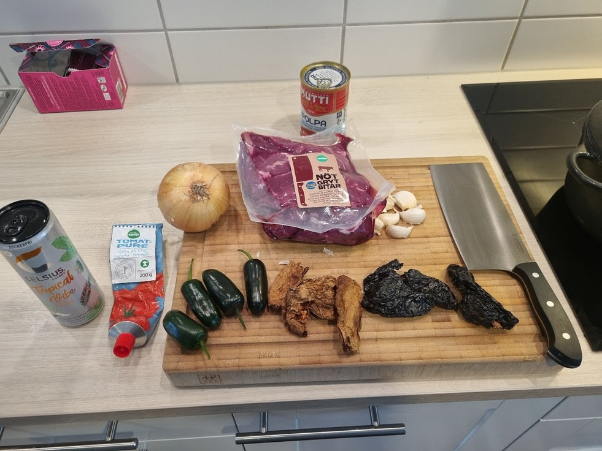
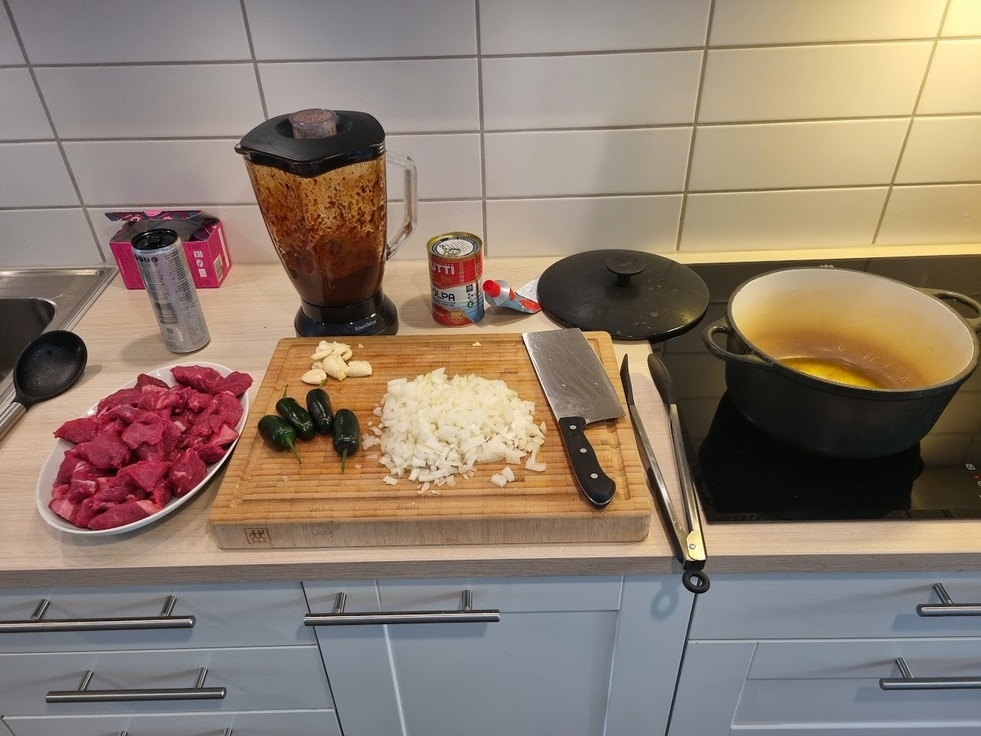
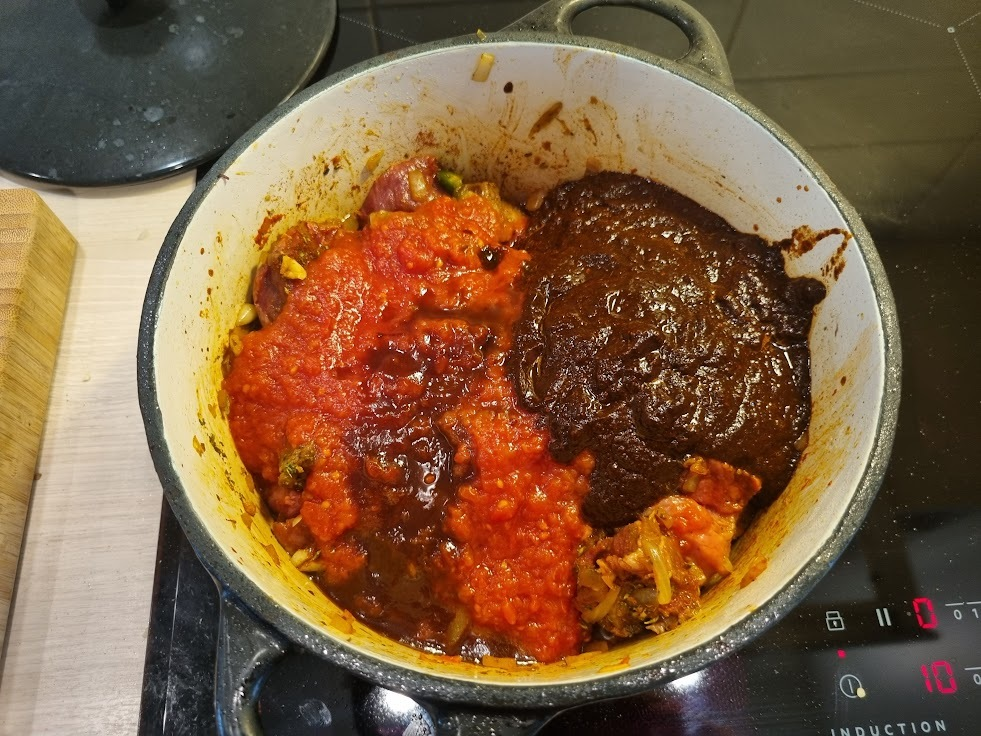
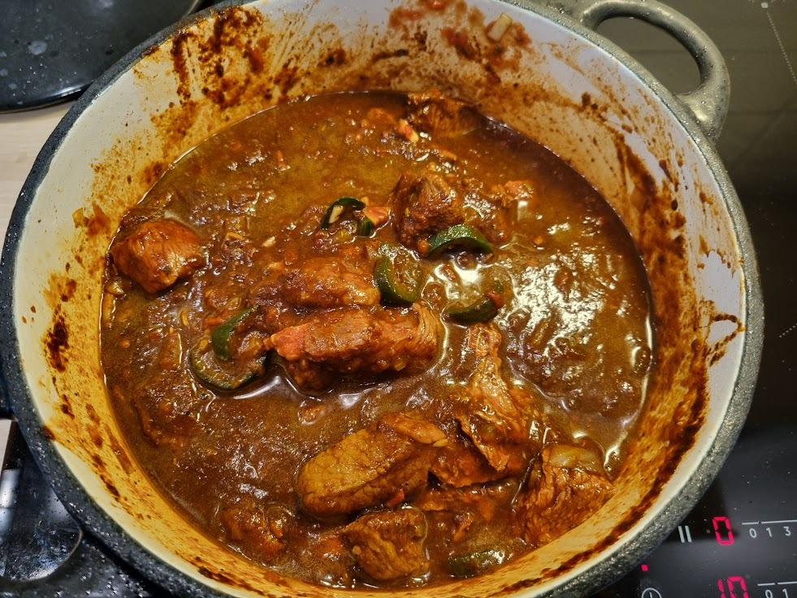
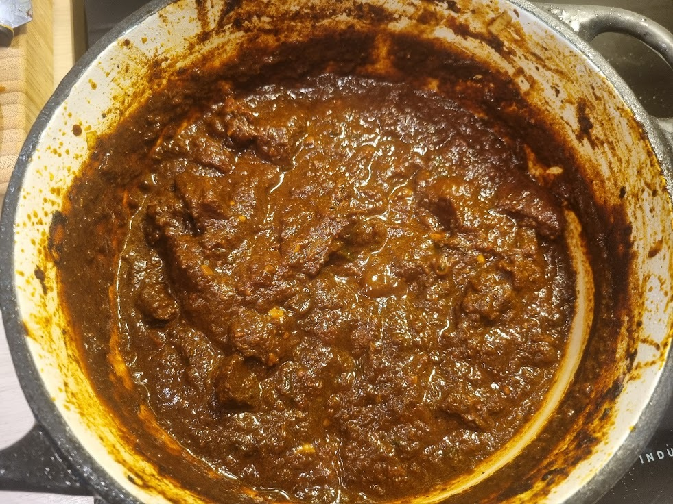

# Chuck Chili

A simple chili, tasty, perfect for the season, and keto-friendly.

## Ingredients

- Mixed chilies, dried or fresh, whatever suites your tastes. Ancho chilies are mandatory, others
  are a bonus. Chipotle highly recommended.
- 1 kg chuck beef.
- One can of tomatoes.
- 0.5L Beef stock.
- 2-3 tbsp Tomato paste.
- At least one big onion.
- Garlic.

## Cooking

- Cut the meat into bite-size chunks, remove silver skin.
- Tear up the dried chilies, toast for a few minutes in a pan.
- Add water to the pan, add a lid and let cook for about 10 minutes.
- Make a paste out of the cooked chilies in a blender, at more water if necessary.
- In the meanwhile, cut the onion finely, crush the garlic and cut up any fresh chilies, such as
  jalapenos.
- Brown half of the meat in a high heat pot for some fond, then remove.
- Set the pot on medium heat and add finely cut onions, let them get soft.
- Add crushed garlic and let cook for a minute or two
- Add tomato paste, mix and let cook for another minute.
- Add the meat back into the pot, as well as the can of tomatoes, beef stock, fresh chilies and
  paste.
- Let simmer for a few hours. In the last case about three, stir every now and then.

## Results

Tasty! Though I do think it should've been on the stove for an hour or so more to make the meat
more tender. Since I'm currently on keto, more vegetables could probably be added too, such as
mushrooms, peppers and broccoli.

If not on keto, toss in kidney beans!

## Pictures

