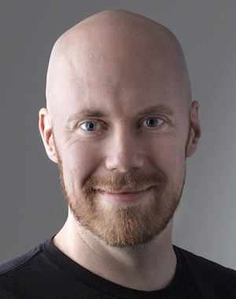

## 1. The Basics

## 2. Work

> ### Lumenradio AB
> Gothenburg, Sweden, March 2019 - Now
>
> Embedded systems developer for the Airglow project, later senior developer for the W-Xbus project,
> leading a team of three. Keywords include ARM, IPv6, Testing, Wireless mesh.

> ### Vinnter AB
> Gothenburg, Sweden, Sept. 2015 - March 2019
>
> Embedded systems developer in a consultant role, spending a majority of the time as an embedded 
> linux specialist at Emerson in Mölnlycke, but also in a few internal projects. The work at Emerson
> has involved plenty of coding, design and some linux kernel development while the internal projects
> involved some electronics design as well.

> ### Layer 10 Collective AB
> Gothenburg, Sweden, Dec. 2011 - Sept 2015
>
> Test and development engineering consultant, primarily deployed at Volvo Trucks and Ericsson. The
> work at Volvo was as a dedicated tester of a telematics platform, which involved a lot of python
> coding, while the time at Ericsson was spent as a C/C++ developer.

> ### Broccoli Engineering AB
> Gothenburg, Sweden, Dec. 2010 - Dec. 2011
>
> Test and development engineering consultant. The majority of the time was spent at QRTech AB, developing
> Volvo and Nissan's VECU and NICU units.

## 3. Education

> ### Communications Engineering, M.Sc.
> Chalmers University of Technology. Dec. 2010.
>
> M.Sc in communications engineering, specializing in communication electronics and signal processing
> for wireless systems.

> ### Electronics Engineering, B.Sc.
> Chalmers University of Technology. May. 2008
>
> B.Sc. Electronics Engineering program.

## 4. Skills

> ### Main industries
> Automotive, telecom, wireless

> ### Programming and scripting languages
> Bash, C, C++, CAPL, LUA, Matlab, Python.

> ### Technologies and tools
> Altium Designer, ARM, ASN.1, AVR, CAN, Eagle, Ethernet, GNU toolchain, Git, Google Protocol Buffers,
> IPv4, IPv6, ISO14229, Makefile, OrCAD, PIC, SVN, ZMQ

> ### Computer skills
> - Excellent knowledge of Linux and FreeBSD, these have been the primary systems for ca 20 years.
> - Good to excellent knowledge of MacOS.
> - Good knowledge of Microsoft Windows
> - Miniscule knowledge of Excel/Sheets. I just can't. Some people can do great stuff, I just get enraged.

## 5. Other

> ### Dungeon Master
> DM for Dungeons and Dragons, leading brave and/or suicidal parties through adventures and quests
> for glory! Lots of planning, storytelling and fun times for all!

> ### Coffee fanatic
> Brewing fanatic, aiming to open everyones' eyes to the glory that is kenyan SL28/SL34 beans brewed
> with a Chemex!

> ### Linux and FreeBSD enthusiast
> Exclusive user of Linux and BSD-based (FreeBSD, OpenBSD, MacOS) systems since 2005. This includes
> more time setting up custom configurations than is probably wise to admit. This website is served
> from my entertainment cabinet.
