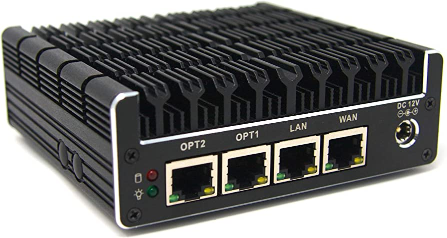

## Intro

For the longest time I've been letting my NAS double as a router, DHCP and VPN server on my home
network. While this worked, having dedicated hardware for the gateway to my home network would be an
improvement, and a simple one.

While I've wanted to do this for the longest time, it wasn't until I saw the
[Protectli Vault FW4C](https://protectli.com/product/fw4c) that I decided to do something about it.
The Vault is a small computer with 4 NICs running and no mechanical parts whatsoever. SSD storage,
and entirely passively cooled while being cheap to run as they don't consume much power.

## The first attempt

The initial idea was to just slap [pfSense](https://pfsense.org) or [OPNSense](https://opnsense.org)
on the shiny new piece of hardware, this quickly turned frustrating. Why one of these? Under the
hood they're both FreeBSD based, OPNSense being a fork of pfSense, which in turn is a fork of the
now discontinued m0n0wall. I love FreeBSD, I've been running FreeBSD since FreeBSD 4.8, so these
make perfect sense to go with!

Both OPNSense and pfSense can do everything I want a firewall to do. They can set up NAT for my
home, they can let me set up firewall rules, including port forwarding for my webserver this page
is served from, and provide network access via several VPN protocols. 

Installation of the system was simple, however setting up firewall rules was... weird. The system
provides what I'm sure are perfectly sensible default rules for a home network, but I like to be
able to tinker with things and I most definitely want to be the one in control. A lot of the
defaults appear to be non-negotiable and couldn't be changed. Logging in with a shell and attempting
to review stuff directly in pf.conf was not an option as a surprising amount of things are tied to
the web interface.

In the end I decided this was not for me. To be clear, I'm sure the stuff I found frustrating with
both OPNSense and pfSense can be fixed and provides what most people need, I just didn't have the
patience to deal with it when trying to peek under the proverbial hood.

## Setting up OpenBSD instead

"Okay, screw it, I'll just give an OpenBSD installation a shot instead"

The irony here is that I wanted to go with OPNsense as a timesaver, but in the end OpenBSD was
surprisingly fast and easy to get going exactly as I wanted it. Grabbing the OpenBSD 7.3 install
image and putting it on a USB stick, the installation was a breeze with what looked like sensible
defaults. I would've loved if ZFS was an option, but alas.

Setting everything up after installation was quick and fairly painless. OpenBSD does a few things
differently from FreeBSD, such as how rc.conf is handled, but all I initially really needed here
was to bring up the WAN interface with DHCP, set up a static IP on the first internal interface, and
finally to create a bridge over the internal interfaces. Internet connectivity as done in a minute.

Next up are the firewall rules. Simply copying my pf.conf from my FreeBSD installation didn't work
as the version of pf in FreeBSD is, well, old. Specifically, setting up NAT didn't work the same, so
some reading was required for how the modern syntax worked. After another couple of minutes I had a
config ready that was accepted.

The only real piece needed after this was to install dhcpd and set it up to provide addresses for my
network. Done in another 2 minutes. Getting everything set up and running was surprisingly fast.

Overall I'm sort of kicking myself for not playing with OpenBSD sooner, despite being very aware of
the project and its goals for 15 years or so. So far I'm loving it!

## Stuff to do

Some things remain to be dealt with in the coming days.

- Wireguard needs to be set up to provide VPN access. The nice thing about running on OpenBSD is
that a driver already exists, apparently free of the issues that plagued the FreeBSD implementation.

- Replace the port forwarding in pf.conf with relayd

- IDS with Suricata

- Set up DNS and DNSSEC with unbound
